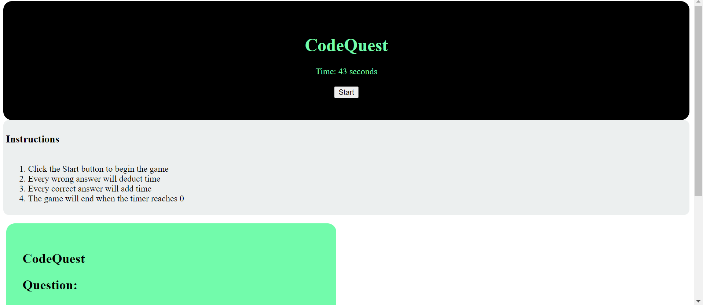

# CodeQuest

## Table of Contents
-Description
-Features
-Technology
-Screenshot
-Link

## Description
"CodeQuest" is an exhilarating and fast-paced quiz game that puts your knowledge and quick thinking to the test. With a countdown clock ticking away from 60 seconds, your goal is to answer a series of questions correctly before time runs out. Every wrong answer deducts time from the clock. At the end of the game you will then be prompted to add your score to the high score list.

## Features
-Count down timer
-Game deducts time from timer when question is answered wrong
-Add score to High Score List

## Technology
-HTML
-CSS
-JavaScript

## Screenshot

## Link
file:///C:/Users/sarah/Desktop/Homework/codequest/index.html
